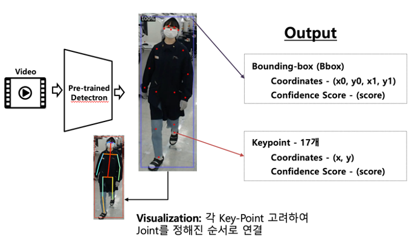
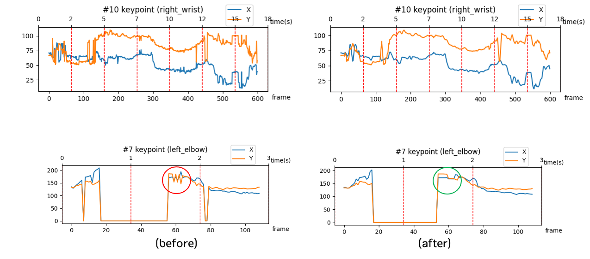
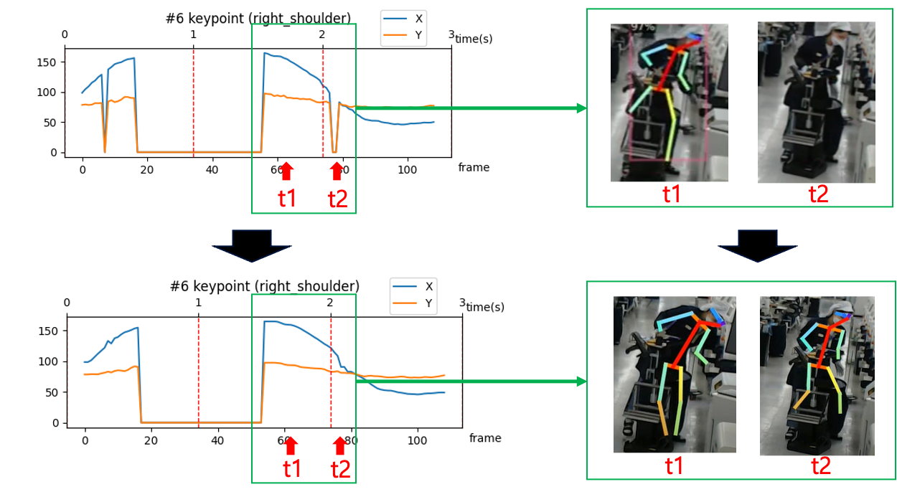

# Environment #
* OS: ubuntu 16.04
* CPU Resource: Inter(R) Core(TM) i7-6700 CPU @ 3.40GHz
* GPU Resource: GTX 1080ti 1x
* Docker Version: 19.03.8

# Direcotry #
~~~
├── build

├── configs

├── demo
    ├── filters
    ├── demo.py
    ├── predictor.py
    └── key.sh

├── detectron2
    ├── checkpoint
    ├── config
    ├── data
    ├── model_zoo
    ├── modeling
    ├── structures
    └── utils
        ├── pose_box_correction.py
        └── video_visualizer.py

├── input
    └── *.mpy
├── model
    └── *.pkl

├── output
    └── *.json

├── docker_setting.sh

└── setup.py
~~~

# Usage #
## Requirement ##
* Recommend using nvidia-docker
  
### Docker ###
~~~zsh
MOUNTED_PATH="/home/cvpr-pu/sungpil/posetron"
NAME="gtc"
docker run --runtime=nvidia -it --name ${NAME} -v /dev/snd:/dev/snd -v ${MOUNTED_PATH}:/${NAME} -v /tmp/.X11-unix:/tmp/.X11-unix:ro -e DISPLAY=unix$DISPLAY \
            --cap-add SYS_PTRACE \
            --ip host khosungpil/gtc:3.0
~~~
1. xhost local:root
2. Edit `MOUNTED_PATH` where code file is in `docker_init.sh`
3. Docker images in dockerhub: https://hub.docker.com/repository/docker/khosungpil/gtc  
It will be installed automatically when run `docker_init.sh`

4. Run `docker_init.sh`
5. Check Mounted folder

## Build ##

## Demo ##
1. Move `demo/key.sh`
~~~zsh
FILE_NAME="meterialCheck_2"
rm -rf ../output/${FILE_NAME}

python demo.py --config-file ../configs/COCO-Keypoints/keypoint_rcnn_R_101_FPN_3x.yaml \
		--video-input ../input/${FILE_NAME}.mp4 \
		--output ../output/${FILE_NAME}/${FILE_NAME}.mp4 \
		--parallel 1 \
		--opts MODEL.WEIGHTS ../model/model_final_997cc7.pkl \
~~~
2. Put the mp4 video fild in `input` folder
3. Edit `${FILE_NAME}` in `demo/key.sh`
4. If you want to use Single GPU, `parallel` is 0 in `demo/key.sh`
5. If you want to use Multi GPU, `parallel` is 1 `demo/key.sh`
6. Run `key.sh`

## Edit detectron2 ##
### demo/demo.py ###
1. Generate detectron2 module for Pose Estimation
2. Generate the list of keypoints information inferencing all video frame through pretrained model.
3. The first refinement of keypoint (refer [video_visualizer.py](#detectron2utilsvideo_visualizerpy))
4. The second refinement of keypoint (refer [MA.py](#detectron2utilsvideo_visualizerpy))
5. Generate json file for Action Recognition

### demo/predictor.py ###
1. Predict keypoints with pretrained pose estimation model. It will be implemented with generator.
2. `PoseRefinement` for writing result information refined by `MovingAvgFilter` in json file.
3. `AsyncPredictor` for optimizing inference speed when use Multi-GPU

### demo/filters/MA.py ###
1. `MovingAvgFilter` class for the second refinement.
2. Fast refinement implementation using generator.
3. Refinement every single current frame seeing previous 5 frames.
4. If there is no predicted keypoints momentarily, calculate compensation value from two-side 5 frames.
5. If there is no predicted keypoints in continuously, return 0 for nothing.
6. Handling exception about no predicted keypoints in first and last frame.

### detectron2/utils/pose_box_correction.py ###
1. Remove box less than threshold from predicted bounding box.
2. Track instance computing each intersection of union in every bounding box and detect overlapped instances. (Overlap)
3. If a bounding box becomes in other bounding box, remove it.
4. detect when the tracked instance is no longer visible for a certain period of time. (Hide)
5. Predict motion for instances in hide state by extrapolation method.
6. Detect instances in sit state using the angle of the waist, knees and ankles. (Sit)

### detectron2/utils/video_visualizer.py ###
1. Sliding window size is 5
2. For the k-th frame, k-5,k-4,...,k...,k+4,k+5 th frames to generate window.
3. Generate triplet matching same instances for single window.
4. Refinement keypoints that score is less than threshold value among keypoints of the k-th frame.
5. Remove the refined keypoints when it is outside the bounding box.

## Result ##

